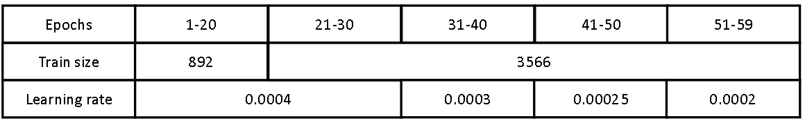
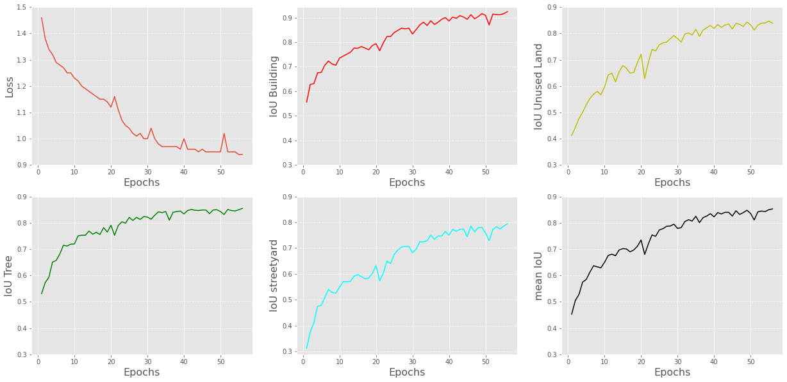
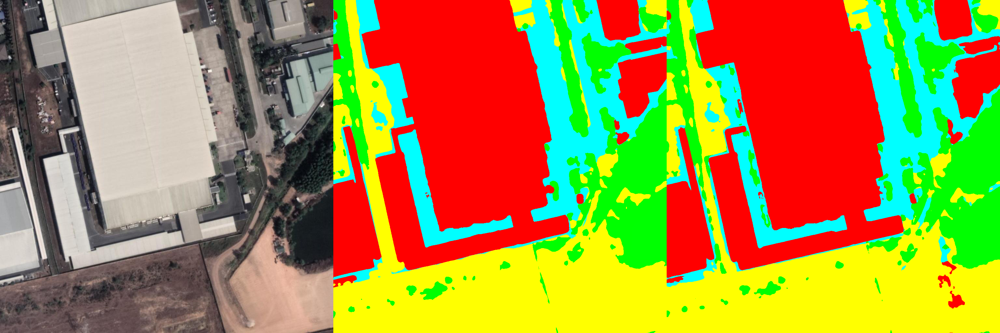

# Giám sát các khu công nghiệp tại Việt Nam sử dụng ảnh vệ tinh và mạng Unet

<p align="center">

</p>

### Yêu cầu:

Sử dụng kĩ thuật Image Semantic Segmentation phân lớp ảnh vệ tinh và so sánh với bản vẽ để đánh giá tiến độ xây dựng KCN.

### Nguồn dữ liệu:

Các mảnh bản đồ Gmap có kích thước 256x256

*sources: https://mt0.google.com/vt?lyrs=s&x=26012&y=14424&z=15*

Trong đó:
* x: Vị trí của mảnh bản đồ theo cột
* y: Vị trí của mảnh bản đồ theo hàng
* z: Độ zoom

### Gán nhãn:

Gán 4 nhãn chỉ các đối tượng trong KCN bao gồm: công trình, đất chưa sử dụng, cây cỏ & hồ nước, sân bãi & đường giao thông
Khu vực được gán nhãn là 3 KCN (Biên Hòa 2, Amata, Loteco), diện tích ảnh tương ứng thực tế là 52.02 km2

### Huấn luyện:

Phân tách nhãn và ảnh dữ liệu thành các mảnh có kích thước 1024x1024
* Train set: 892 ảnh chồng lấn 512 px và 3566 ảnh chồng lấn 256 px
* Validate set: 288 ảnh không chồng lấn

Augmentation: Vertical flip, Horizontal flip, Random rotate

Tham số huấn luyện:
* Batch_size: 1 – Bước tích lũy: 128 => ~ Batch_size 128 
* Loss: CrossEntropyLoss - Optimizer : Adam
* Learning rate giảm sau mỗi 10 epochs từ epoch 30
* Metrics: IoU

<p align="center">

</p>

```bash
python train.py -e 60 -b 1 -l 4e-4
```

### Kết quả:

<p align="center">

</p>

Kết quả tốt nhất:
* Công trình: 92.4%
* Đất chưa sử dụng: 83.9%
* Cây cỏ & hồ nước: 85.5%
* Sân bãi * đường giao thông: 79.4%

<p align="center">

</p>

<p align="center">
image---------------------------------label---------------------------------predict
</p>
